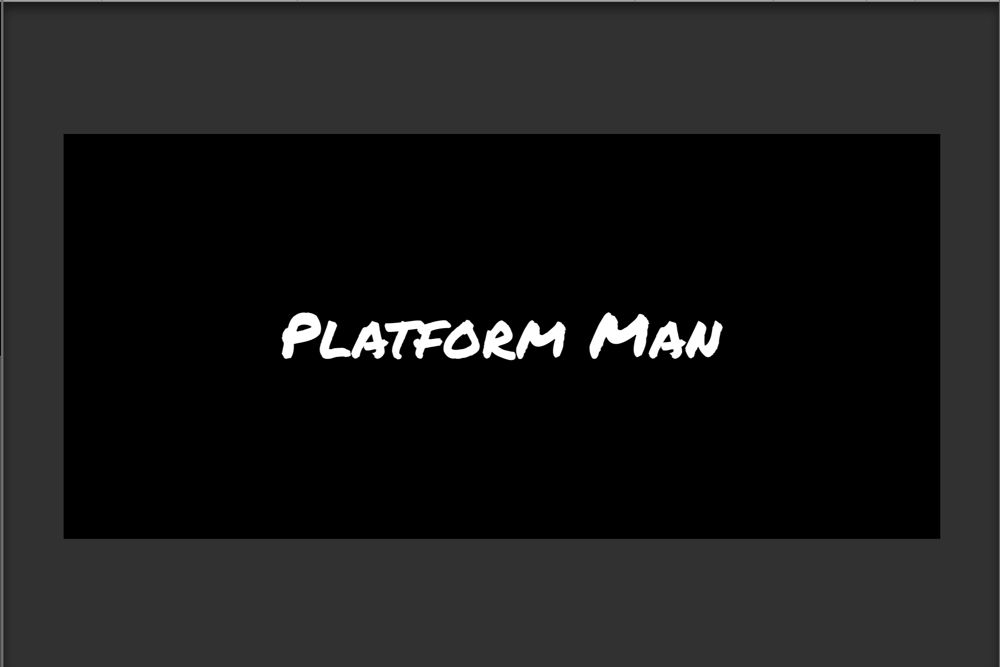
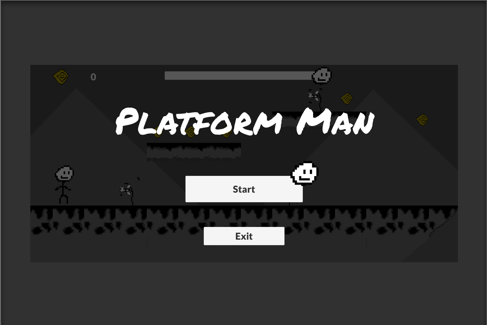
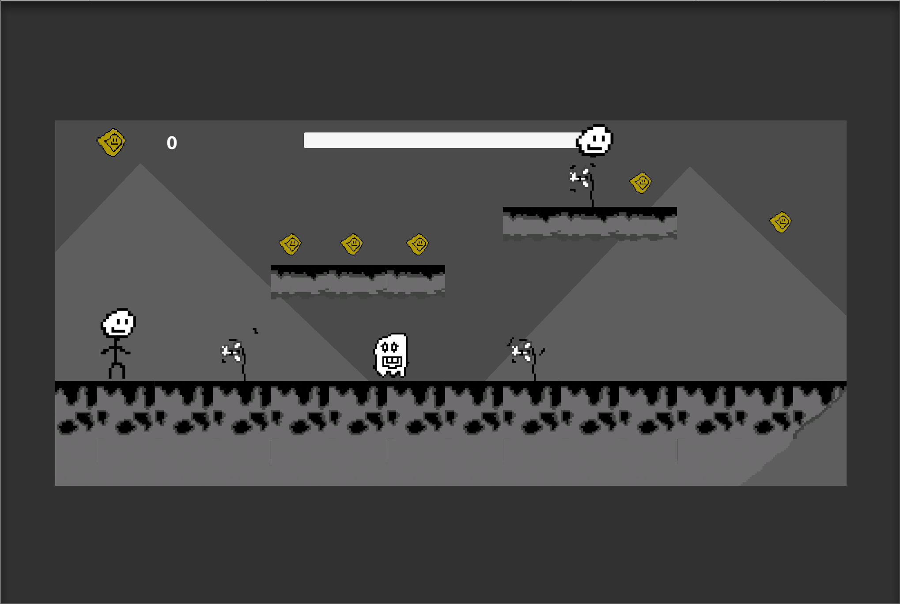
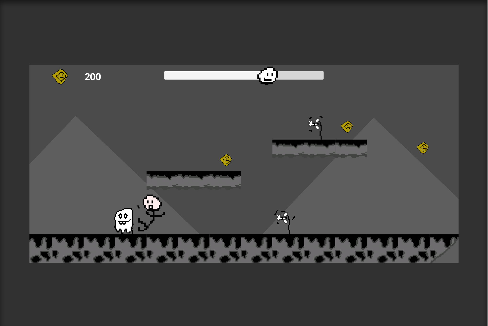
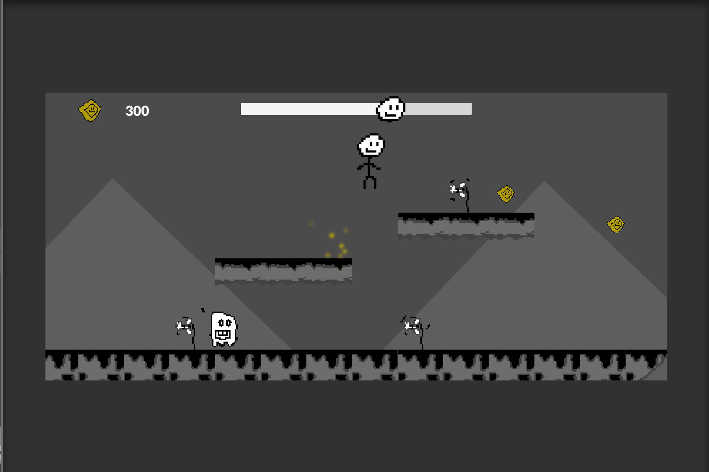
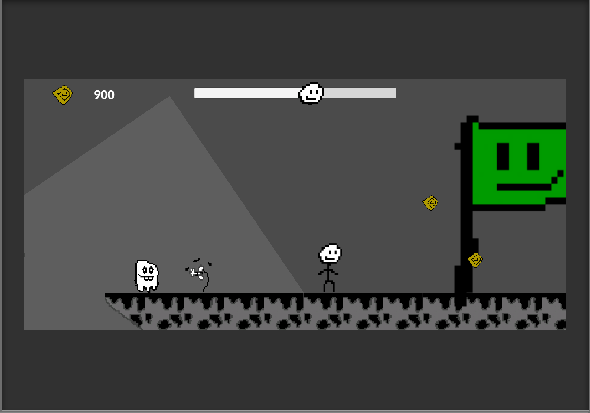
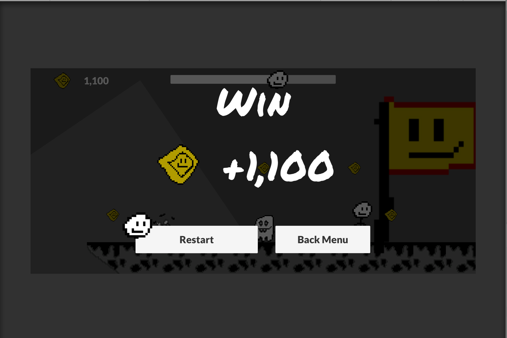
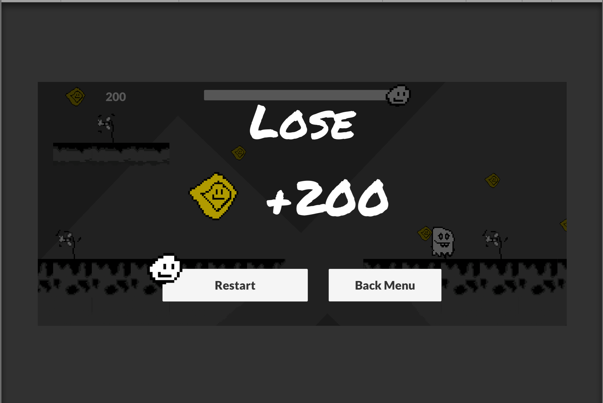

# PlatformMan

This game is about an stick man who wants arrive to the goal and win all the coins. The game was developed with Unity and C# language, the resources made in https://www.piskelapp.com/ and the fonts are from Google Fonts.

## Requirements
You need the following programs:
* Unity3D (2020.1.15f1)

## Packages used
* C#
* Cinemachine
* TileMap

## Installation
First download the project or clone the repository, run Unity Hub and attach the project.

## Run
In order to start the project you have to press the button play in Unity

## Views
### Splash

### Menu

### First view

### Damage from enemy

### Earn coins

### End game

### Win game

### Lose game

